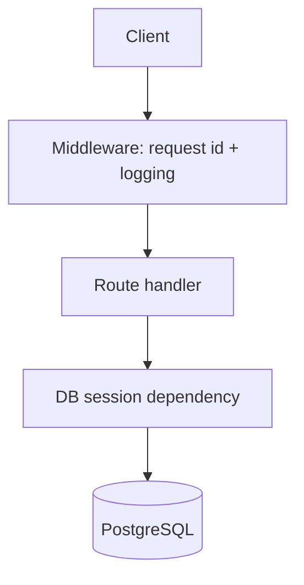

# Architecture

A small, service-separated API for the SupportDesk domain (sample reference implementation).

## Goals

- stay runnable in minutes
- be reviewable quickly (clear modules, typed models, tests)
- demonstrate “production-shaped” basics: logging, DB access, CI

## High-level components

- **FastAPI app**: `app/factory.py` + thin ASGI entrypoint in `app/main.py`
- **Routes**: `app/routes/tickets.py`
- **DB**: SQLAlchemy engine + dependency injection (`app/db.py`)
- **Config**: pydantic-settings (`app/config.py`)
- **Logging**: structured JSON logs + request id (`app/middleware.py`)

## Request flow

## Local dev story

- `docker compose up -d --build` starts API + Postgres
- tests run via `pytest`

## Repo hygiene

- do not commit generated outputs (e.g., `.venv/`, `dist/`). CI includes a hygiene check.
